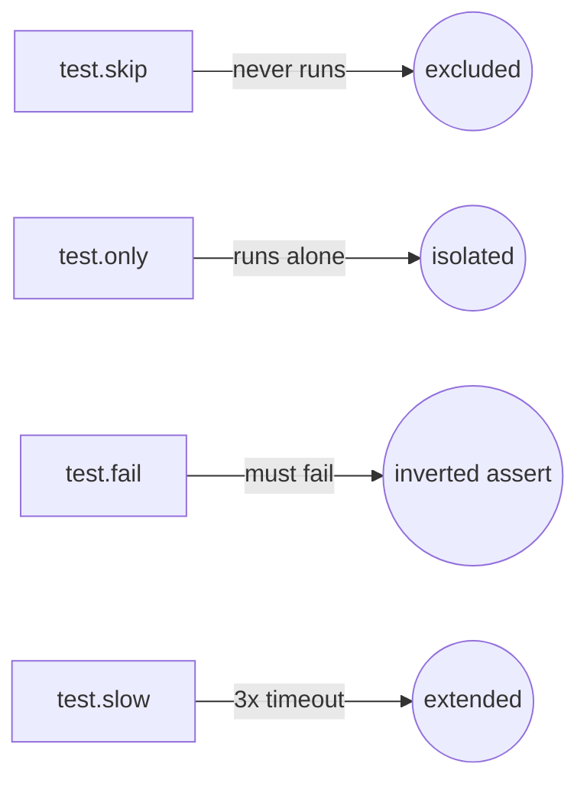
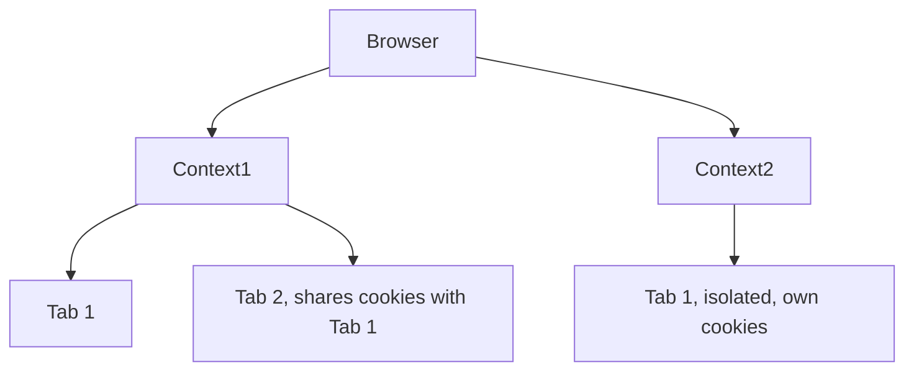

# Learning Playwright Fundamentals 2x

A hands-on starter project for learning [Playwright](https://playwright.dev/) end-to-end testing with TypeScript. Part of **The Testing Academy** Playwright Fundamentals course.

## Tech Stack

- [Playwright Test](https://playwright.dev/docs/intro) `^1.61.1`
- TypeScript / Node.js (`@types/node`)

## Prerequisites

- [Node.js](https://nodejs.org/) 18+ (LTS recommended)
- npm (ships with Node)

## Getting Started

```bash
# 1. Install dependencies
npm install

# 2. Install Playwright browsers
npx playwright install
```

## Running Tests

```bash
# Run all tests (headless)
npx playwright test

# Run in headed mode (watch the browser)
npx playwright test --headed

# Run a single spec
npx playwright test tests/example.spec.ts

# Run in UI mode (interactive)
npx playwright test --ui

# Debug a test
npx playwright test --debug
```

## Viewing the Report

After a run, open the HTML report:

```bash
npx playwright show-report
```

## Project Structure

```
.
├── tests/
│   ├── 01_Basics/                    # Test anatomy, annotations (skip/only/fail/slow)
│   ├── 02_First_tests/               # Browser → Context → Page (BCP) hierarchy
│   ├── 03_Locators_Commands/ … 23_Advance_Framework/   # Curriculum modules (scaffolded, WIP)
│   ├── Template.spec.ts              # Empty spec scaffold, copy for new tests
│   └── example.spec.ts               # Sample: title check + "Get started" navigation
├── playwright.config.ts    # Playwright configuration
├── package.json
└── .gitignore
```

## What's Inside

`tests/example.spec.ts` demonstrates two core patterns:

1. **Assertions** — verify the page title matches `/Playwright/`.
2. **Navigation + role locators** — click the *Get started* link and assert the *Installation* heading is visible.

### 01 - Test Anatomy & Annotations

**Concept:** every Playwright spec is `test(name, async ({ page }) => {...})`: `page` is a fixture, injected fresh per test, not something you create. Annotations (`.skip`, `.only`, `.fail`, `.slow`) tag a test's execution mode without touching its body.

**Why:** during dev you constantly need to isolate one test (`.only`), silence a broken one (`.skip`), or flag a known-fail (`.fail`), without commenting code out.

**Q&A: why use this?**
- **Q: What breaks if `test.only` ships to CI?** A: Every other test in that run gets skipped, most CI configs (`forbidOnly: !!process.env.CI`) fail the build to catch this.
- **Q: `.skip` vs `.fail`?** A: `.skip` never runs the test. `.fail` runs it and expects a failure, flips to an error if it unexpectedly passes.
- **Q: Can I skip conditionally?** A: Yes, `test.skip(condition, reason)` inside the test body, e.g. skip only on `firefox`.



```ts
// Conditional skip, reads browserName from the fixture
test('conditional', async ({ page, browserName }) => {
    test.skip(browserName === 'firefox', 'Not supported in Firefox');
});
```

### 02 - Browser, Context, Page (BCP) Hierarchy

**Concept:** Playwright models automation in three nested layers: one **Browser** process, many **Contexts** (isolated sessions, like separate incognito windows), each with many **Pages** (tabs). Cookies/storage never leak across contexts; pages in the same context share them.

**Why:** testing multi-user flows (admin + guest, two logged-in accounts) needs real session isolation, launching a whole new browser per user is wasteful; a new context is cheap and isolated.

**Q&A: why use this?**
- **Q: When do I need a second context instead of a second page?** A: When the two sessions must NOT share cookies/auth, e.g. admin vs. viewer logged in simultaneously.
- **Q: Does the `test()` fixture give me a context for free?** A: Yes, `{ page }` already comes with its own context. Use `{ browser }` when a test needs to spin up *extra* contexts manually.
- **Q: What's the cleanup order?** A: Reverse of creation: close pages, then contexts, then the browser.



```ts
test("two users interact", async ({ browser }) => {
    const adminContext = await browser.newContext();
    const adminPage = await adminContext.newPage();

    const guestContext = await browser.newContext();
    const guestPage = await guestContext.newPage();

    await adminPage.goto("https://app.vwo.com/#login");
    await guestPage.goto("https://app.vwo.com/#dashboard/home");

    await adminContext.close();
    await guestContext.close();
});
```

Context options (`viewport`, `locale`, `timezoneId`, `geolocation`, or a full device profile like `userAgent` + `isMobile` for mobile emulation) are passed into `browser.newContext({...})`, see [`237_BCP_Test_Options.spec.ts`](tests/02_First_tests/237_BCP_Test_Options.spec.ts).

## Configuration Highlights

Defined in `playwright.config.ts`:

- `testDir: './tests'` — where specs live
- `testMatch: ['tests/**/*.spec.ts']` — recurses into every numbered module folder
- `fullyParallel: true` — run test files in parallel
- `reporter: 'html'` — generate an HTML report
- `trace: 'on'`, `screenshot: 'on'`, `video: 'on'` — full debug artifacts for every run (heavier, dial back for CI)
- `headless: false`, `viewport: 1920x1080` — watch tests run during course recording
- Projects: Firefox active; Chromium and WebKit currently commented out
- CI-aware retries and workers (`process.env.CI`)

In Playwright, **`testInfo`** is a special object passed as the second argument to your test functions and hooks (like `beforeEach` or `afterEach`). It acts as a metadata bundle containing rich information about the **currently executing test case**.

While fixtures like `page` or `context` control the browser, `testInfo` gives you deep insights into the test runner's execution state, environment configuration, and reporting capabilities.

---

## How to Access `testInfo`

You can access it by simply declaring it as the second parameter in your test block or hooks:

```typescript
// Inside a test
test('My Test Name', async ({ page }, testInfo) => {
    // testInfo is available here
});

// Inside a hook
test.afterEach(async ({ page }, testInfo) => {
    // testInfo is available here to inspect how the test ended
});

```

---

## Top 5 Practical Uses of `testInfo`

### 1. Attaching Custom Files or Screenshots (`testInfo.attach`)

If a test fails or handles complex data, you can attach text logs, custom screenshots, or JSON files directly to the Playwright HTML report so they appear in your test dashboard.

```typescript
test('Generate custom attachment', async ({ page }, testInfo) => {
    await page.goto('/invoice-page');
    
    // Grab some text data from the page
    const invoiceDetails = await page.locator('.invoice-data').innerText();

    // Attach it as a text log to the HTML report
    await testInfo.attach('invoice-log', {
        body: invoiceDetails,
        contentType: 'text/plain'
    });
});

```

### 2. Handling Flaky Tests via Retry Counts (`testInfo.retry`)

If your test run permits retries (e.g., `retries: 2` in `playwright.config.ts`), you can check the current retry iteration. This is incredibly helpful for cleaning up state or modifying waits only when a test is struggling.

```typescript
test('Smart wait on retry', async ({ page }, testInfo) => {
    await page.goto('/dashboard');

    // If this is a retry attempt, apply a longer timeout or extra wait
    if (testInfo.retry > 0) {
        console.log(`⚠️ Retry attempt #${testInfo.retry}. Adding safety delay...`);
        await page.waitForTimeout(3000); 
    }
    
    await page.locator('#submit-btn').click();
});

```

### 3. Dynamic Artifact Paths (`testInfo.outputDir`)

Playwright creates a unique folder for every test case run to store videos, traces, and screenshots. `testInfo.outputDir` provides the absolute path to that specific folder, allowing you to save custom files exactly where Playwright expects them.

```typescript
import path from 'path';
import fs from 'fs';

test('Save custom PDF download', async ({ page }, testInfo) => {
    await page.goto('/downloads');
    
    // Construct a path inside Playwright's default test output directory
    const customFilePath = path.join(testInfo.outputDir, 'downloaded_report.pdf');
    
    // Write or download a file to that location
    fs.writeFileSync(customFilePath, 'Dummy PDF content data');
});

```

### 4. Dynamic Logging & Metadata (`testInfo.title` & `testInfo.project.name`)

You can extract the test title or the specific project configuration (e.g., *Chromium Desktop*, *Mobile Safari*) to build distinct runtime logs or condition your test assertions.

```typescript
test('Log execution environment', async ({ page }, testInfo) => {
    // Output: "Running: Log execution environment on browser project: Chromium"
    console.log(`Running: ${testInfo.title} on browser project: ${testInfo.project.name}`);
});

```

### 5. Post-Test Analysis in Hooks (`testInfo.status`)

In the `afterEach` hook, you can evaluate whether the test passed, failed, or timed out to execute conditional cleanup routines or trigger alert mechanisms.

```typescript
test.afterEach(async ({ page }, testInfo) => {
    // Check if the current test case failed
    if (testInfo.status !== testInfo.expectedStatus) {
        console.log(`❌ Test "${testInfo.title}" failed with status: ${testInfo.status}`);
        // You could trigger a custom Slack webhook or clean up a database state here
    }
});

```

---
what is testInfo and use
In Playwright, testInfo is a special object passed as the second argument to your test functions and hooks (like beforeEach or afterEach). It acts as a metadata bundle containing rich information about the currently executing test case.

While fixtures like page or context control the browser, testInfo gives you deep insights into the test runner's execution state, environment configuration, and reporting capabilities.
test('Generate custom attachment', async ({ page }, testInfo) => {
    await page.goto('/invoice-page');
    
    // Grab some text data from the page
    const invoiceDetails = await page.locator('.invoice-data').innerText();

    // Attach it as a text log to the HTML report
    await testInfo.attach('invoice-log', {
        body: invoiceDetails,
        contentType: 'text/plain'
    });
});

2. Dynamic Logging & Metadata (testInfo.title & testInfo.project.name)
You can extract the test title or the specific project configuration (e.g., Chromium Desktop, Mobile Safari) to build distinct runtime logs or condition your test assertions.

## Summary Cheat Sheet of Common `testInfo` Properties

| Property | Return Type | Description |
| --- | --- | --- |
| **`testInfo.title`** | `string` | The name string of the current test case. |
| **`testInfo.status`** | `string` | The current result status (`'passed'`, `'failed'`, `'timedOut'`, or `'skipped'`). |
| **`testInfo.retry`** | `number` | The current retry execution index (starts at `0` for the first run). |
| **`testInfo.outputDir`** | `string` | Absolute path to the unique directory allocated for this test's artifacts. |
| **`testInfo.project`** | `object` | Accesses configurations defined in `playwright.config.ts` (like environment variables, project name, etc.). |
| **`testInfo.attach()`** | `function` | Injects text, files, or images into the final execution test report. |

In Playwright, these three methods are used to extract data from elements, but they behave differently depending on **hidden text**, **multiple elements**, and **form fields**.

Here is the breakdown for an automation expert.

---

### 1. `textContent()`

This retrieves the text inside a **single** element.

* **Behavior:** It returns the text of the element and all its children. Importantly, it includes text that might be hidden by CSS (e.g., `display: none`).
* **Return Type:** `Promise<string | null>`
* **Wait Logic:** It automatically waits for the element to be present in the DOM.

```typescript
// HTML: <div id="status">Active <span style="display:none">Hidden Info</span></div>

const text = await page.textContent('#status');
console.log(text); // Output: "Active Hidden Info"

```

---

### 2. `allTextContents()`

This is used when your locator matches **multiple** elements (like a list or table rows).

* **Behavior:** It grabs the text from every matching element and puts them into an array.
* **Return Type:** `Promise<string[]>`
* **Wait Logic:** **Warning!** This method does **not** auto-wait. If the elements haven't loaded yet, it returns an empty array `[]`. You should ensure the elements are present first.

```typescript
// HTML: <ul class="items"><li>Apple</li><li>Orange</li></ul>

const listItems = await page.locator('.items li').allTextContents();
console.log(listItems); // Output: ["Apple", "Orange"]

```

---

### 3. `inputValue()`

This is specifically for **form elements** (`<input>`, `<textarea>`, `<select>`).

* **Behavior:** It does not look at the text *between* tags. Instead, it looks at the `value` attribute—the text a user has typed into a box.
* **Return Type:** `Promise<string>`
* **Wait Logic:** It auto-waits for the element to be an input/textarea.

```typescript
// HTML: <input id="username" value="rakesh_sahu">

const val = await page.inputValue('#username');
console.log(val); // Output: "rakesh_sahu"

```

---

### 🧪 Comparison Summary

| Method | Best For... | Returns | Auto-waits? |
| --- | --- | --- | --- |
| **`textContent()`** | Single element (div, span, p) | `string` | **Yes** |
| **`allTextContents()`** | Lists/Tables (multiple items) | `string[]` | **No** |
| **`inputValue()`** | Form fields (input, textarea) | `string` | **Yes** |

### 🏆 Pro Tip: `innerText()` vs `textContent()`

In interviews, you might be asked about `innerText()`.

* **`innerText`** is "user-aware"—it only returns what the user can actually see on the screen (it ignores hidden text).
* **`textContent`** is "DOM-aware"—it returns everything in the code, even if it's hidden.

**Architect's Choice:** Usually, we prefer `textContent()` or `innerText()` for assertions, but `allTextContents()` is the go-to for validating the contents of a dynamic web table.

1. textContent()
This retrieves the text inside a single element.

Behavior: It returns the text of the element and all its children. Importantly, it includes text that might be hidden by CSS (e.g., display: none).

Return Type: Promise<string | null>

Wait Logic: It automatically waits for the element to be present in the DOM.
// HTML: <div id="status">Active <span style="display:none">Hidden Info</span></div>

const text = await page.textContent('#status');
console.log(text); // Output: "Active Hidden Info"
2. allTextContents()
This is used when your locator matches multiple elements (like a list or table rows).

Behavior: It grabs the text from every matching element and puts them into an array.

Return Type: Promise<string[]>

Wait Logic: Warning! This method does not auto-wait. If the elements haven't loaded yet, it returns an empty array []. You should ensure the elements are present first.
// HTML: <ul class="items"><li>Apple</li><li>Orange</li></ul>

const listItems = await page.locator('.items li').allTextContents();
console.log(listItems); // Output: ["Apple", "Orange"]
3. inputValue()
This is specifically for form elements (<input>, <textarea>, <select>).

Behavior: It does not look at the text between tags. Instead, it looks at the value attribute—the text a user has typed into a box.

Return Type: Promise<string>

Wait Logic: It auto-waits for the element to be an input/textarea.
// HTML: <input id="username" value="rakesh_sahu">

const val = await page.inputValue('#username');
console.log(val); // Output: "rakesh_sahu"
## Learn More

- [Playwright Docs](https://playwright.dev/docs/intro)
- [The Testing Academy](https://thetestingacademy.com/)

## License

ISC
